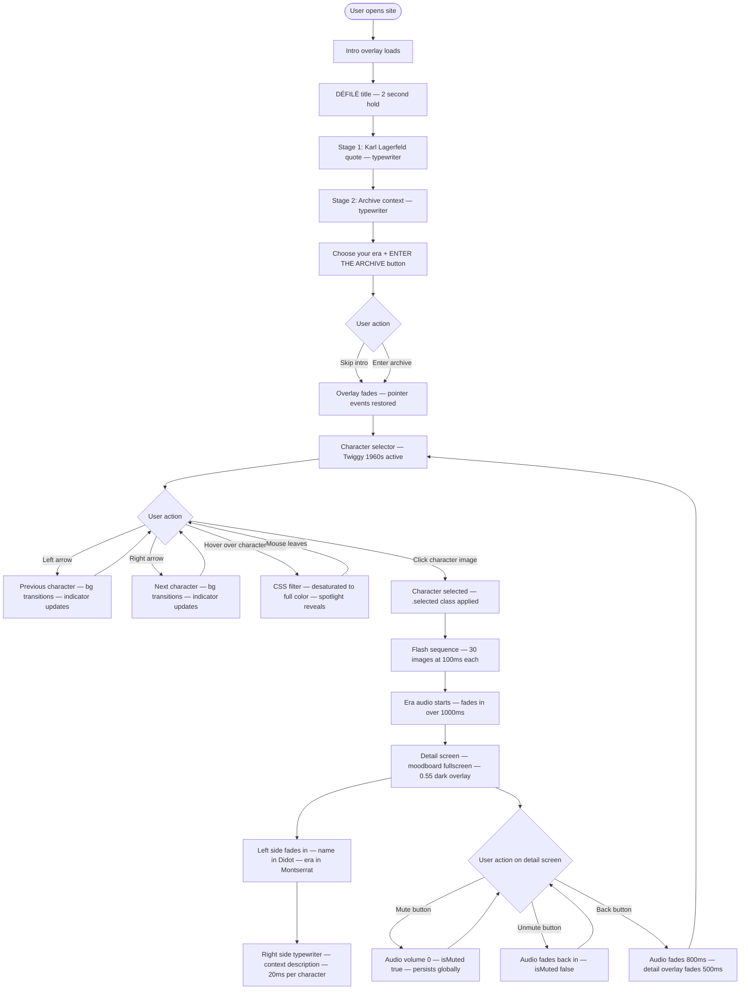

# DÉFILÉ — AI 201: Hero Faction Screen

**Student:** Valeria Munera
**Course:** AI 201 — Creative Computing with AI
**Professor:** Tim Lindsey
**Institution:** SCAD
**Semester:** Spring 2026

---

## Live Site

[View DÉFILÉ Live](https://valeriamuneraa-debug.github.io/CreativeComputingWithAI/)

---

## Project Overview

DÉFILÉ is an interactive fashion archive and character 
selector that navigates through five iconic fashion eras 
from the 1960s to the 2000s. Each era is represented by 
an iconic supermodel, a defining designer, and a signature 
garment — translated into a cinematic, hover-driven 
single-page experience.

The five characters are:
- **1960s** — Twiggy — André Courrèges
- **1970s** — Lauren Hutton — Yves Saint Laurent
- **1980s** — Christie Brinkley — Gianni Versace
- **1990s** — Kate Moss — Calvin Klein / Helmut Lang
- **2000s** — Gisele Bündchen — Dior by John Galliano

---

## Design Intent

**Concept:** A fashion era character selector functioning 
as a living fashion archive. Five decades, five women, 
five moments that changed the way the world dressed.

**Typography:**
- Headlines: GFS Didot, 48px
- Supporting elements: Montserrat, 32px and 24px

**Visual Hierarchy:**
- Character is always the dominant focal point
- Character name: top left, largest text element
- Year: directly below name, smaller
- Designer/brand: bottom right corner

**Era Color Palettes:**

| Era | Primary Base | Accent | Highlight |
|-----|-------------|--------|-----------|
| 1960s | #3E2A35 | #8B4513 | #D2B48C |
| 1970s | #4A4A4A | #6B705C | #F1E9D7 |
| 1980s | #555B60 | #D4AF37 | #F5F5F5 |
| 1990s | #B2B2B2 | #404040 | #F2F2F2 |
| 2000s | #4D5663 | #925E4D | #B09168 |

**Hover Behavior:**
All characters begin in a desaturated sketch-like 
initial state. On hover over the character image, 
they transition into full color with an era-specific 
spotlight effect at 400ms ease-in-out.

**Non-Negotiable Rules per Era:**
- 1960s: Sharp geometric silhouettes only
- 1970s: Le Smoking philosophy — feminine countered by masculine structure
- 1980s: Status and hardware mandatory — bold aggressive silhouette
- 1990s: No decorative elements — functional structure only
- 2000s: Minimalism forbidden — every surface must have texture

---

## System Diagram

---

## AI Direction Log

See full log at [claude/ai-direction-log.md](claude/ai-direction-log.md)

**Summary of entries:**
1. Session 2 — Infrastructure scaffold
2. Session 3 — Design Intent translation to CSS Grid layout
3. Session 4 — JavaScript carousel and image integration
4. Session 5 — Character images, spotlights, visual polish
5. Session 5 — Intro overlay sequence rebuild
6. Session 5 — Character detail screen and flash sequence
7. Session 5 — Lauren Hutton era-specific treatments
8. Cross-session — Gemini character generation (all 5 eras)

---

## Records of Resistance

See full records at [claude/records-of-resistance.md](claude/records-of-resistance.md)

**Summary:**
1. AI began making design decisions during Session 2 — shut down immediately
2. AI assumed wrong image filenames — corrected to match actual assets
3. Gemini rendered Kate Moss too old — facial features corrected
4. Intro overlay sequence mixed stages incorrectly — rebuilt three times
5. Christie Brinkley rendered as casino art — style corrected using reference images
6. Spotlight effects appeared as background halos — replaced with Kate Moss reference implementation

---

## Five Questions Reflection

See full reflection at [claude/reflection-questions.md](claude/reflection-questions.md)

---

## Tech Stack

- Vanilla JavaScript (no framework)
- Vite (build tool)
- CSS Grid
- GitHub Pages (deployment)
- GitHub Actions (CI/CD)

## ESF Documentation

All ESF documentation is located in the `claude/` folder:
- `context.md` — Project context and status log
- `steps.md` — Session-by-session recreation guide
- `ai-direction-log.md` — Full AI Direction Log
- `records-of-resistance.md` — Full Records of Resistance
- `reflection-questions.md` — Five Questions Reflection
- `design-intent.pdf` — Original Design Intent document
- `system-diagram.md` — Mermaid system flow diagram

---

## Design Intent Document

The complete Design Intent document including moodboards, 
color palettes, character references, and visual hierarchy 
rules is available here:

[View Design Intent PDF](claude/design-intent.pdf)

---

*DÉFILÉ — The screen is the first impression. Make it yours.*
