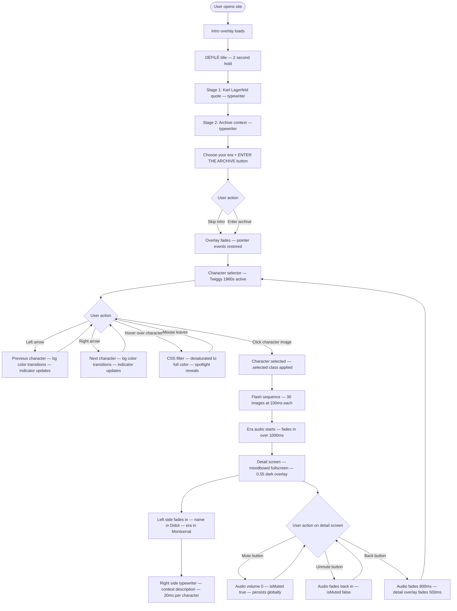

```mermaid
flowchart TD
    A([User opens site]) --> B[Intro overlay loads]
    B --> C[DÉFILÉ title — 2 second hold]
    C --> D[Stage 1: Karl Lagerfeld quote — typewriter]
    D --> E[Stage 2: Archive context — typewriter]
    E --> F[Choose your era + ENTER THE ARCHIVE button]
    F --> G{User action}
    G -->|Skip intro| H[Overlay fades — pointer events restored]
    G -->|Enter archive| H
    H --> I[Character selector — Twiggy 1960s active]
    I --> J{User action}
    J -->|Left arrow| K[Previous character — bg color transitions — indicator updates]
    J -->|Right arrow| L[Next character — bg color transitions — indicator updates]
    K --> J
    L --> J
    J -->|Hover over character image| M[CSS filter — desaturated to full color — spotlight reveals]
    M -->|Mouse leaves| J
    J -->|Click character image| N[Character selected — .selected class applied]
    N --> O[Flash sequence — 30 images at 100ms each]
    O --> P[Era audio starts — fades in over 1000ms]
    P --> Q[Detail screen — moodboard fullscreen — 0.55 dark overlay]
    Q --> R[Left side fades in — name in Didot — era in Montserrat]
    R --> S[Right side typewriter — context description — 20ms per character]
    Q --> T{User action on detail screen}
    T -->|Mute button| U[Audio volume 0 — isMuted true — persists globally]
    U --> T
    T -->|Unmute button| V[Audio fades back in — isMuted false]
    V --> T
    T -->|Back button| W[Audio fades 800ms — detail overlay fades 500ms]
    W --> I
```
